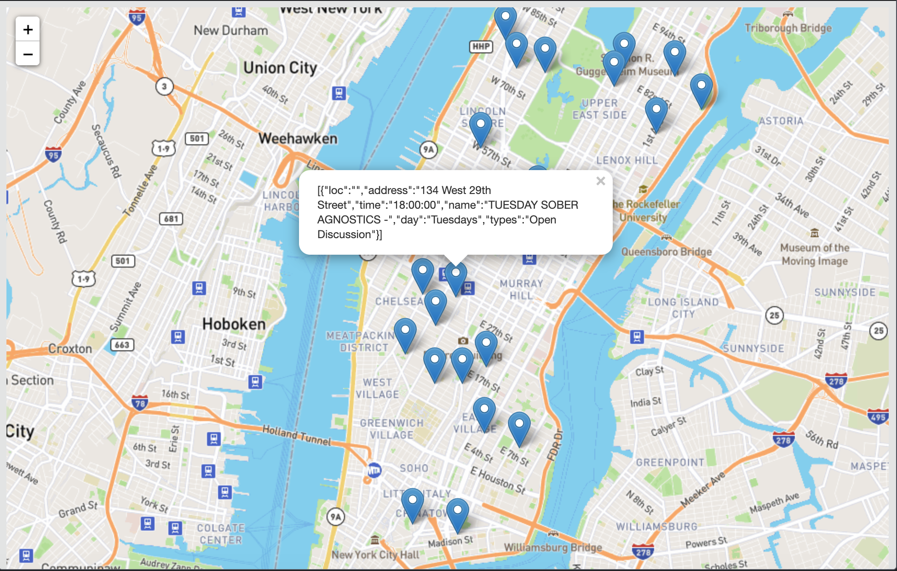
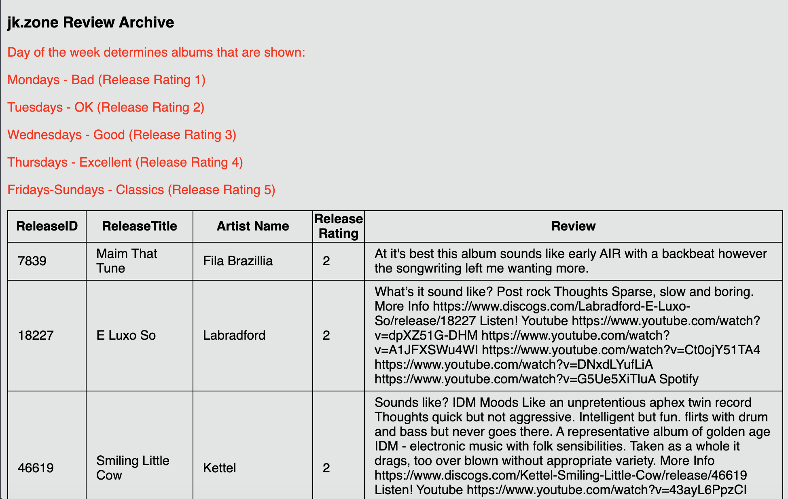
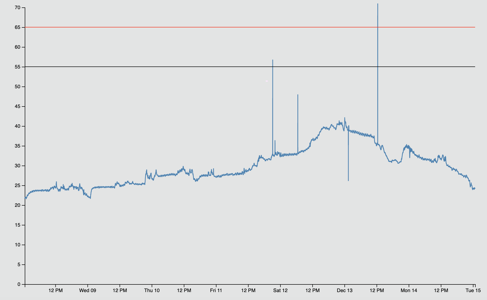

# Final Assignments
## Background
The files contained here are the codebase for the iterations of the assignments. All work done in javascript, node.js, html, SQL, dynamoDB. Earlier work was done in weekly assignments:

### AA Map
A reimagined interactive map for finding Alcoholics Anonymous meetings
[Scraping Original URLs](https://github.com/justinkraus/data-structures/tree/master/wa01)
[Parse Street Addresses](https://github.com/justinkraus/data-structures/tree/master/wa02)
[Get Geolocations of Meetings](https://github.com/justinkraus/data-structures/tree/master/wa03)
[Load Meetings into PSQL Database](https://github.com/justinkraus/data-structures/tree/master/wa04)
[Querying the PSQL Database](https://github.com/justinkraus/data-structures/tree/master/wa06)
[Additional Data parsing and Loading (primary work for final project)](https://github.com/justinkraus/data-structures/tree/master/wa07)

### Process Blog
A music blog archive stored in a No SQL database
[Data overview and load into No SQL](https://github.com/justinkraus/data-structures/tree/master/wa05)
[No SQL Queries](https://github.com/justinkraus/data-structures/tree/master/wa06)

### Humidity Sensor
[Writing live sensor outputs through an API to SQL](https://github.com/justinkraus/data-structures/tree/master/wa09)


## Data Structure Changes
While working on the final iterations, certain data structure changes needed to be made from the original weekly assignments linked above. While these were not major to the weekly assignments they were necessary for the functionality. These files are found within the directory structure_changes.

### AA Map
Created a new SQL table that includes additional columns to house integer values of days and hours that will be used in a comparison SQL query during the final app. As an example Monday is represented as 1, Tuesday as 2, etc. Hours are represented as military-time hours instead of with 12hr AM/PM designations.

```javascript
// from file wa07psql2.js
// duplicate meetlinglist table
"CREATE TABLE meetinglist1 AS SELECT * FROM meetinglist;"

// add new column for integer value of days
`ALTER TABLE meetinglist1
                     ADD COLUMN daynum INTEGER;
                 UPDATE meetinglist1
                SET daynum = CASE
                     WHEN day = 'Mondays' THEN 1
                     WHEN day = 'Tuesdays' THEN 2
                     WHEN day = 'Wedensdays' THEN 3
                     WHEN day = 'Thursdays' THEN 4
                     WHEN day = 'Fridays' THEN 5
                     When day = 'Saturdays' THEN 6
                     When day = 'Sundays' THEN 7
                  END;`;


//add new 'hournum' column with value as integer
`ALTER TABLE meetinglist1 ADD COLUMN hournumstr varchar(255);`
"UPDATE meetinglist1 SET hournumstr = to_char(start_time, 'HH24');";
```

### Process Blog
During [Weekly Assignment 6](https://github.com/justinkraus/data-structures/tree/master/wa06) it was apparent that the process blog data would need to be restructured. The unique identifier I was using as the primary key restricted my queries to focus on this at the central attribute being queried which was not useful. To work around this I added a placeholder primary key that was consistent for all records, this then allowed querying on  the sort key as needed. 

```javascript
// found in wa05v1.js, jkzone_reviews1.json, wa06av1.js
// add dummy key / value to all JSON objects
"placeholder_id": "123"

// add new records 
           "placeholder_id": entry.placeholder_id,
            "Release_ID":  entry.Release_ID,
            "Artist_Name": entry.Artist_Name,
            "Release_Title":  entry.Release_Title,
            "Release_Rating": entry.Release_Rating,
            "Review_Content": entry.Review_Content,
            "Release_Year": entry.Release_Year,
            "Tags": entry.Tags,
            "Discogs_URL": entry.Discogs_URL,
            "Video_Array": entry.Video_Array,
            "Spotify_ID": entry.Spotify_ID

// revised query with placeholder id and ability to filter freely on ratings or additional fields
var params = {
    TableName : "jkzone2",
    KeyConditionExpression: "placeholder_id = :placeholder_id",
    FilterExpression: 'Release_Rating >= :rating',
    ExpressionAttributeValues: {
        ":placeholder_id": {S: "123"},
        ":rating": {N: "5"}
}};

```

## Final Projects
The final projects use node and express to act as a local webserver from the cloud 9 platform on AWS. Each makes a query to the respective database and displays the results on an html page, the primary file for this is app.js. This file includes a number of standard variables and database credentials that won't be referenced in this writeup which will focus on core-functionality for querying and displaying the data.

### AA Map
The AA Map displays the remaining meetings for that day as leaflet.js markers on a mapbox map. Each tooltip has supporting information such as time of the meeting and type. The html for this is located in the app.js file on lines 37-75. 

The primary SQL query for displaying information
```javascript

// create time and date variables of the current time in New York
var now = moment.tz(Date.now(), "America/New_York"); 
var dayy = now.day().toString(); 
var hourr = now.hour().toString(); 


//query the database to find the remaining meetings for the day
`SELECT latitude, longitude, daynum, hournumstr, json_agg(json_build_object('loc', location, 'address', address, 'time', start_time, 'name', meetingName, 'day', day, 'types', type)) as meetings
FROM meetinglist1
WHERE daynum = ` + dayy + 'and CAST(hournumstr AS int) >= ' + hourr +  
`GROUP BY latitude, longitude, daynum, hournumstr
;`;
```
The results of the SQL query are then stored as variable "data" within an HTML template. Using javascript, the data variable is parsed to display each record as an individual leaflet marker and displayed on a mapbox map

```javascript
for (var i=0; i<data.length; i++) {
    L.marker( [data[i].latitude, data[i].longitude] ).bindPopup(JSON.stringify(data[i].meetings)).addTo(mymap);
}
``` 



### Process Blog
The process blog uses day of the week as a variable for filtering the dataset. The blog is an archive of over 400 reviews of albums, each assigned a 1-5 score. The day when the process blog is accessed will determine which albums are shown. For example, on Monday only albums with a score of 1 will be shown, Fridays - Sundays will show albums with a score of 5.

```javascript
// lookup the current day
	var now = moment.tz(Date.now(), "America/New_York"); 
	var dayy = now.day().toString(); 

// map the results of the day to a 1-5 album score
    function rateNum(dayy) {
        let result;
        if ((dayy == 1)) {
            result = "1";
        }
        else if ((dayy == 2)) {
            result = "2";
        }
        else if ((dayy == 3)) {
            result = "3";
        }
        else if ((dayy == 4)) {
            result = "4";
        }
        else if ((dayy >= 5)) {
            result = "5";
        }
        return result;
    }

    var ratingNum = rateNum(dayy)


// lookup the albums that match this score
    var params = {
        TableName : "jkzone2",
        KeyConditionExpression: "placeholder_id = :placeholder_id",
        FilterExpression: 'Release_Rating = :rating',
        ExpressionAttributeValues: {
            ":placeholder_id": {S: "123"},
            ":rating": {N: ratingNum}
    }};
```
The results are displayed on an html file in a table view



### Humidity Sensor
The humidity sensor outputs the last week of humidity sensor readings onto a line chart. The line chart has two guidelines on it at key humidity levels: 55 which is the current humidity setting on the dehumidifier and 65 which is the level where mold can start growing.

The database is queried for the last week of records through a SQL query. The Between 10 and 75 limits were used to remove erroneous records written by the sensor.
```javascript
`SELECT * FROM sensorData WHERE sensorvalue BETWEEN 10 AND 75 ORDER BY sensortime DESC LIMIT 10080;`;
```
These results are then displayed on an html file using the d3 graphing library.

