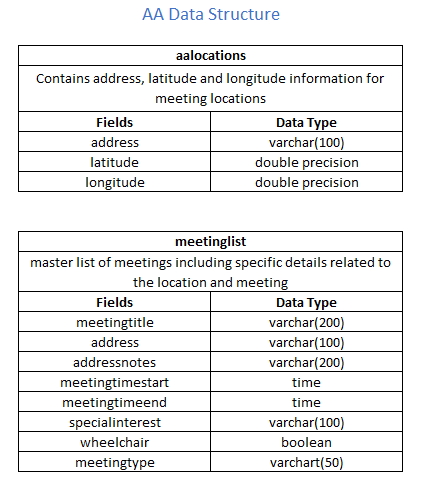

# Weekly Assignment 4

The purpose of this script is to design a relational data schema for the AA meetings, create a PostgreSQL database in AWS, and input AA meetings location data into the PostgreSQL database. Starter code for the assignment is provided [here](https://github.com/visualizedata/data-structures/blob/master/weekly_assignment_04.md)

## Database Schema
A primary focus for this week is proposing an appropriate structure for our data to be stored in. This design, known as the data schema, considers both the data types we are working with as well as the actual data values to target an ideal state for our information. 

I've proposed the below structure for my database as it consolidates the meetings and associated information in one table with the location information in another. Additional tables could have been created to house categories such as meetingtype but for the current data set I felt it was overkill (although a possible future consideration is to seperate it for dropdown values using primary key linkages).



## Create PostgreSQL Instance
Prior to beginning the programtic portion of code below a PostgreSQL instance was setup through the AWS console. Instructions on how to do this can be found [here](https://aws.amazon.com/rds/postgresql/resources/).


## Connecting to the database
This weekly assignment utilizes three different javascript files. Each of these represent specific commands that interact with the PostgreSQL database. In order to do this each of the files required a first portion of code focuses on entering credentials and connecting to the database thorugh AWS. This consistent code is shown here:
```javascript
const { Client } = require('pg');
const dotenv = require('dotenv');
dotenv.config({path: '/home/ec2-user/environment/data-structures/.env'});  

// AWS RDS POSTGRESQL INSTANCE
var db_credentials = new Object();
db_credentials.user = 'stan';
db_credentials.host = 'data-structures.cz4rib340wda.us-east-1.rds.amazonaws.com';
db_credentials.database = 'aa';
db_credentials.password = process.env.AWSRDS_PW;
db_credentials.port = 5432;

// Connect to the AWS RDS Postgres database
const client = new Client(db_credentials);
client.connect();
```

## Create Tables
The first script, wa04.js, is used to create tables in the PostgreSQL instance. In addition to the consistent code documented in the 'Connecting to the database' section creating the tables was done through two queries that specified the table structure as shown in the above 'database schema' section. I ran this script twice for thisQuery and thisQuery1 replaced in the client.query command.

```javascript
// create aalocations table for address info:
var thisQuery = "CREATE TABLE aalocations (address varchar(100), lat double precision, long double precision);";
// create meetinglist table for additional meeting info:
var thisQuery1 = "CREATE TABLE meetinglist (meetingtitle varchar(200), address varchar(100), addressnotes varchar(200), meetingtimestart time, meetingtimeend time, specialinterest varchar(100), wheelchair boolean, meetingtype varchar(50));";

client.query(thisQuery1, (err, res) => {
    console.log(err, res);
    client.end();
});
```
## Populate Tables
The second script, wa04b.js, populates the aalocations table with the address and geolocation information from weekly assignment three. First the addressesForDb variable is created that contains the JSON objects from weekly assignment three with three fields address, Latitude, and Longitude. 

```javascript
var addressesForDb = [{"address":"122 E 37TH ST New York NY ","Latitude":"40.7483929","Longitude":"-73.9787906"},{"address":"30 E 35TH ST New York NY ","Latitude":"40.7496221","Longitude":"-73.9855348"},{"address":"350 E 56TH ST New York NY ","Latitude":"40.757654","Longitude":"-73.963834"},{"address":"619 LEXINGTON AVE New York NY ","Latitude":"40.6894374","Longitude":"-73.9367705"},{"address":"122 E 37TH ST New York NY ","Latitude":"40.7483929","Longitude":"-73.9787906"},{"address":"28 E 35TH ST New York NY ","Latitude":"40.7496065","Longitude":"-73.9854965"},{"address":"350 E 56TH ST New York NY ","Latitude":"40.757654","Longitude":"-73.963834"},{"address":"283 LEXINGTON AVE New York NY ","Latitude":"40.7479969","Longitude":"-73.9783809"},{"address":"122 E 37TH ST New York NY ","Latitude":"40.7483929","Longitude":"-73.9787906"},{"address":"619 LEXINGTON AVE New York NY ","Latitude":"40.6894374","Longitude":"-73.9367705"},{"address":"141 E 43RD ST New York NY ","Latitude":"40.7518754","Longitude":"-73.9747248"},{"address":"122 E 37TH ST New York NY ","Latitude":"40.7483929","Longitude":"-73.9787906"},{"address":"122 E 37TH ST New York NY ","Latitude":"40.7483929","Longitude":"-73.9787906"},{"address":"141 E 43RD ST New York NY ","Latitude":"40.7518754","Longitude":"-73.9747248"},{"address":"209 MADISON AVE New York NY ","Latitude":"40.7486487","Longitude":"-73.9821254"},{"address":"122 E 37TH ST New York NY ","Latitude":"40.7483929","Longitude":"-73.9787906"},{"address":"619 LEXINGTON AVE New York NY ","Latitude":"40.6894374","Longitude":"-73.9367705"},{"address":"240 E 31ST ST New York NY ","Latitude":"40.7430963","Longitude":"-73.9780494"},{"address":"114 E 35TH ST New York NY ","Latitude":"40.7473169","Longitude":"-73.9800724"},{"address":"230 E 60TH ST New York NY ","Latitude":"40.7615607","Longitude":"-73.9649474"},{"address":"244 E 58TH ST New York NY ","Latitude":"40.7600925","Longitude":"-73.9653811"},{"address":"619 LEXINGTON AVE New York NY ","Latitude":"40.6894374","Longitude":"-73.9367705"},{"address":"325 PARK AVE New York NY ","Latitude":"40.7574552","Longitude":"-73.9733937"},{"address":"236 E 31ST ST New York NY ","Latitude":"40.74314","Longitude":"-73.9781525"},{"address":"308 E 55TH ST New York NY ","Latitude":"40.7576943","Longitude":"-73.9657436"},{"address":"244 E 58TH ST New York NY ","Latitude":"40.7600925","Longitude":"-73.9653811"},{"address":"244 E 58TH ST New York NY ","Latitude":"40.7600925","Longitude":"-73.9653811"},{"address":"109 E 50TH ST New York NY ","Latitude":"40.7569178","Longitude":"-73.97309"}];
```
The next portion of the script uses the eachSeries method of the async module which waits for the method to complete before moving onto the next (side note, coming from python where I haven't needed this functionality its nice to learn about it here as I see its importance in ensuring nothing is missed). The next portion of code uses the SQL Insert statement to add these values into the aalocations table. 

```javascript
async.eachSeries(addressesForDb, function(value, callback) {
    const client = new Client(db_credentials);
    client.connect();
    var thisQuery = "INSERT INTO aalocations VALUES (E'" + value.address + "', " + value.Latitude + ", " + value.Longitude + ");";
    client.query(thisQuery, (err, res) => {
        console.log(err, res);
        client.end();
    });
    setTimeout(callback, 1000); 
}); 
```
## Ensure Table is Populated
In wa04c we again connect to the PostgreSQL database and ensure that the insert statements have populated the information correctly using a SQL 'Select * ' statement. This selects all the records in the aalocations table and prints them with a console.log command.

```javascript
// Sample SQL statement to query the entire contents of a table: 
var thisQuery = "SELECT * FROM aalocations;";

client.query(thisQuery, (err, res) => {
    console.log(err, res.rows);
    client.end();
});
```
