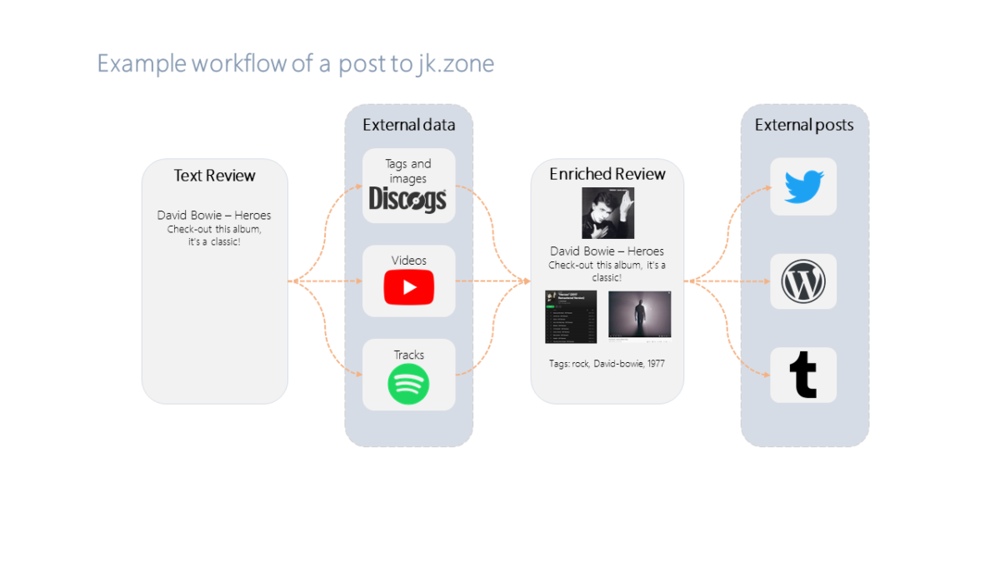
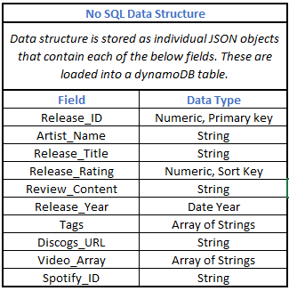

# Weekly Assignment 5

The purpose of this script is to design a data model for a repository of blog posts, create a DynamoDB database in AWS, and input blog entries into the DynamoDB database. Starter code for the assignment is provided [here](https://github.com/visualizedata/data-structures/blob/master/weekly_assignment_04.md).

## The Data
The data I'll be using for the Dynamo DB instance is taken from a music blog project I ran for a few years. I would write notes about an album I listened to and enhanced it with rich media information (youtube links and Spotify objects) to create full blog posts. These were saved as a queryable database in a wordpress.org instance. I'd like to move away from wordpress in the future and rely on a more sophisticated api structure for recording information in the future so I'm using this opportunity to restructure my data.

Here's an example workflow using the David Bowie album Heroes. I write a short text review, this triggers external api calls to Discogs and Spotify for media information, that information is added to my review to create a blog post to jk.zone and supporting outlets.




## Database Schema
A primary focus for this week is proposing an appropriate structure for our data to be stored in. This design, known as the data model, considers both the data types we are working with as well as the actual data values to target an ideal state for our information. 

I've proposed the below structure for my data model as it consolidates the individual blog posts and associated information in one table. 



## Create DynamoDB Table
Prior to beginning the programtic portion of code below a DynamoDB table was setup through the AWS console. Instructions on how to do this can be found [here](https://docs.aws.amazon.com/amazondynamodb/latest/developerguide/getting-started-step-1.html).

## Data Structure
Individual entries were saved as JSON objects in key, value pairs. Here's an example:
```JSON
  {
    "Release_ID": 11613072,
    "Artist_Name": "A.A.L. (Against All Logic)",
    "Release_Title": "2012 - 2017",
    "Release_Rating": 4,
    "Review_Content": "Review Goes Here",
    "Release_Year": 2018,
    "Tags": "Experimental , Electronic ",
    "Discogs_URL": "https://www.discogs.com/AAL-Against-All-Logic-2012-2017/release/11613072",
    "Video_Array": "https://www.youtube.com/watch?v=MmbqC_2cBWw, , ",
    "Spotify_ID": "1uzfGk9vxMXfaZ2avqwxod"
  }
```

## Adding entries to the table
To add these entries to the table I largely followed the [instructions on the AWS site here](https://docs.aws.amazon.com/amazondynamodb/latest/developerguide/GettingStarted.NodeJs.02.html). My full script is shown below: 
```javascript
var AWS = require("aws-sdk");
var fs = require('fs');

AWS.config.update({
    region: "us-east-1",
});

var docClient = new AWS.DynamoDB.DocumentClient();

console.log("Importing entries into DynamoDB. Please wait.");

var allEntries = JSON.parse(fs.readFileSync('jkzone_sample.json', 'utf8'));
allEntries.forEach(function(entry) {
    var params = {
        TableName: "jkzone",
        Item: {
            "Release_ID":  entry.Release_ID,
            "Artist_Name": entry.Artist_Name,
            "Release_Title":  entry.Release_Title,
            "Release_Rating": entry.Release_Rating,
            "Review_Content": entry.Review_Content,
            "Release_Year": entry.Release_Year,
            "Tags": entry.Tags,
            "Discogs_URL": entry.Discogs_URL,
            "Video_Array": entry.Video_Array,
            "Spotify_ID": entry.Spotify_ID
            
        }
    };

    docClient.put(params, function(err, data) {
       if (err) {
           console.error("Unable to add entry", entry.Release_Title, ". Error JSON:", JSON.stringify(err, null, 2));
       } else {
           console.log("PutItem succeeded:", entry.Release_Title);
       }
    });
});
```

## Connecting to the table
The first portion of the script configures the AWS connection, I only needed to specify the region and create a variable that specifies a dynamodb document client object. This client object is used to pass input parameters to the specified table that's covered in the next section of code. Other methods of interacting with dynamoDB require attribute values to be explicitly set but using DocumentClient does not

```javascript
var AWS = require("aws-sdk");
var fs = require('fs');

AWS.config.update({
    region: "us-east-1",
});

var docClient = new AWS.DynamoDB.DocumentClient();

console.log("Importing entries into DynamoDB. Please wait.");
```

## Adding Entries
The next portion of script reads a json file that contains three json objects structured as outlined in the Data Structure section above. The array method ForEach is used to parse these objects as individual entries, specifies the table name to add the entries to (jkzone) and what column the pieces of each individual entry will be added to. 

The portion in quotes is the column name of the DynamoDB table, the 'entry.' portion refers to the key name in each of the JSON objects. The tutorial I linked above shows an alternative approach to explicitly setting each key name and instead wrapping these in another JSON object. An interesting approach I might use in the future as that would avoid issues where fields aren't consistent (for my data I know each entry has this information.

The final piece of this code takes of these entries and puts them into the table using the DocClient variable we set above. 

Worked well! I was able to confirm through the frontend tool that there are indeed three entires add to my specification.

```javascript
var allEntries = JSON.parse(fs.readFileSync('jkzone_sample.json', 'utf8'));
allEntries.forEach(function(entry) {
    var params = {
        TableName: "jkzone",
        Item: {
            "Release_ID":  entry.Release_ID,
            "Artist_Name": entry.Artist_Name,
            "Release_Title":  entry.Release_Title,
            "Release_Rating": entry.Release_Rating,
            "Review_Content": entry.Review_Content,
            "Release_Year": entry.Release_Year,
            "Tags": entry.Tags,
            "Discogs_URL": entry.Discogs_URL,
            "Video_Array": entry.Video_Array,
            "Spotify_ID": entry.Spotify_ID
            
        }
    };

    docClient.put(params, function(err, data) {
       if (err) {
           console.error("Unable to add entry", entry.Release_Title, ". Error JSON:", JSON.stringify(err, null, 2));
       } else {
           console.log("PutItem succeeded:", entry.Release_Title);
       }
    });
});
```