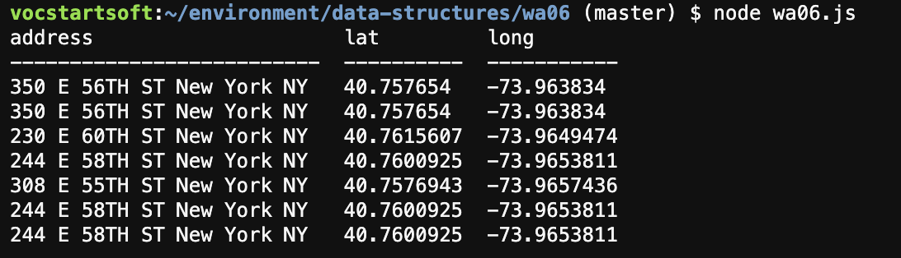
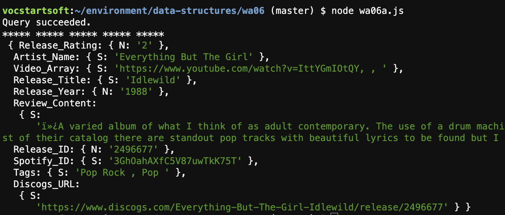

# Weekly Assignment 6

The purpose of these scripts is to query data from the PostgreSQL table used to store AA meeting information ([background information on that table is included in weekly assignment 4](https://github.com/justinkraus/data-structures/tree/master/wa04)) 
and the DynamoDB table used to store my music blog ([background information on that table is included in weekly assignment 5](https://github.com/justinkraus/data-structures/tree/master/wa05)). 


## PostgreSQL Query
In weekly assignment 4 we began to query the table to check that records had been populated. The script for this assignment is provided in the wa06.js file which shares a lot of the similarities as the weekly assignment 4.

### Connecting to the database
The first portion of code focuses on entering credentials and connecting to the database throuugh AWS.
```javascript
const { Client } = require('pg');
const dotenv = require('dotenv');
dotenv.config({path: '/home/ec2-user/environment/data-structures/.env'});  

// AWS RDS POSTGRESQL INSTANCE
var db_credentials = new Object();
db_credentials.user = 'stan';
db_credentials.host = 'data-structures.cz4rib340wda.us-east-1.rds.amazonaws.com';
db_credentials.database = 'aa';
db_credentials.password = process.env.AWSRDS_PW;
db_credentials.port = 5432;

// Connect to the AWS RDS Postgres database
const client = new Client(db_credentials);
client.connect();
```

### Query Table
Using a SQL 'Select * ' statement, the below script selects all the records in the aalocations table between ranges of latitude and longitude coordinates.  I envision this to be a reusable query for the final project where the user might want to look at meetings
in a specific area. The below query would mimic specifications of a rectangle size the user would be inerested in. The locations that are between these geocoordinates are then printed into the console.

```javascript
// Select latitude and longitude ranges
var adrPoint = "SELECT * FROM aalocations WHERE (lat BETWEEN 40.5 and 40.8) AND (long BETWEEN -73.97 and -73.94)";

// Execute the query by changing 'thisQuery'
client.query(adrPoint, (err, res) => {
    if (err) {throw err}
    else{
    console.table(res.rows);
    client.end();
    }
});
```
### Query Results



## DynamoDB Query
The script to query DynamoDB is located in wa06a.js. As DynamoDB stores data in a No SQL format, querying the data is similar to JSON where the query is structured around keys. These keys are similar to field or column names in SQL.

### Connecting to the Database
This portion of code connects to the dynamodb instance and then creates a new object 'var dynamodb' where the parameters of the query will be passed.


```javascript
var AWS = require("aws-sdk");
var fs = require('fs');

AWS.config.update({
    region: "us-east-1",
});

var dynamodb = new AWS.DynamoDB();

```

### Querying the Database
The primary portion of the query is structured around passing the parameters where:
```
TableName
``` 
Represents the table being queried
```
KeyConditionExpression
``` 
The query that specifies what fields you're targeting, a comparison operator (the equals sign below but there are additional options depending on the field), and the value the field 
you're looking against stored as a variable denoted with a ":".
```
ExpressionAttributeValues
``` 
are the values used for key condition expression. The type of value is passed, N for number is used in mine query, and then the value itself.

The challenge I had here is that the query is required to have the primary key be set as an '=' comparison operator. My primary key uses a unique numeric ID that doesn't have a lot of informative value meaning that it is not
something a user would typically need to query. I may need to restructure my data as a result of this.

The remaining portion of the script enters the parameter query into the dynamoDB instance and prints the results to the console.


```javascript
var params = {
    TableName : "jkzone",
    KeyConditionExpression: "Release_ID = :releaseID and Release_Rating = :rating",
    ExpressionAttributeValues: {
        ":releaseID": {N: "2496677"},
        ":rating": {N: "2"}
}};

dynamodb.query(params, function(err, data) {
    if (err) {
        console.error("Unable to query. Error:", JSON.stringify(err, null, 2));
    } else {
        console.log("Query succeeded.");
        data.Items.forEach(function(item) {
            console.log("***** ***** ***** ***** ***** \n", item);
        });
    }
});
```
### Query Results
