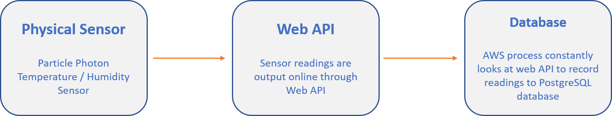
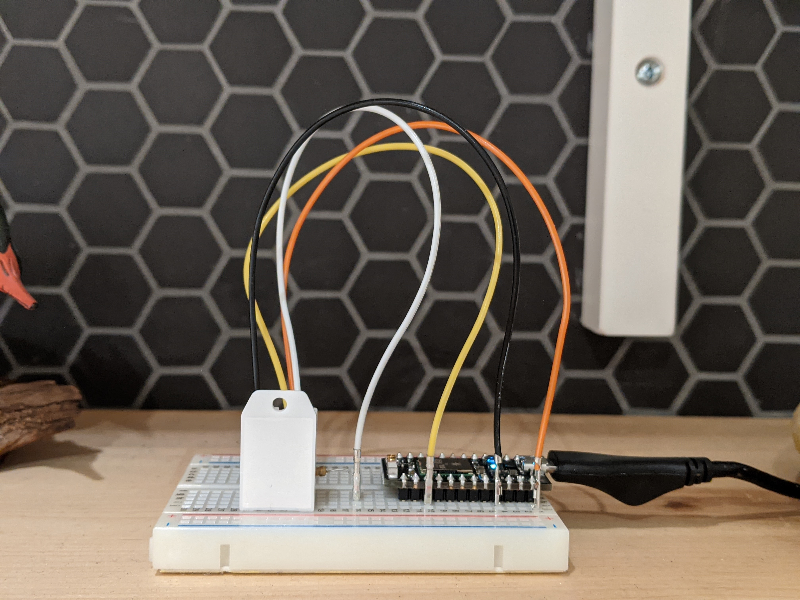
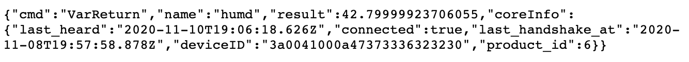
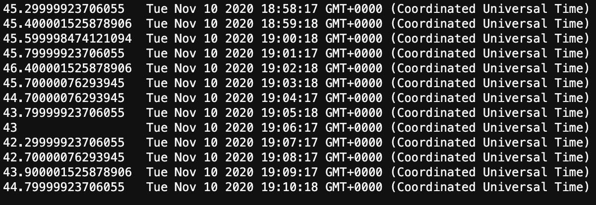

# Weekly Assignment 9
The purpose of this assignment is to write data from a temperature / humidity sensor to a PostgreSQL database in AWS. This is effectively a real-time recording of data as the sensor is setup to record a value every minute. I've  chosen to record the humidity values in my basement.

## Background
Below is a high level overview of the process.



### The Sensor
Data is recorded through a Particle Photon with temperature sensor. It connects to the internet via a wifi chip and sends a temperature/humidity reading to a specific web location.



### Web API
Data sent to the web location is output on a dashboard and API. I've chosen to record the humidity variable which is displayed as a standardized JSON object.



### Database
Through the JavaScript process manager pm2, AWS cloud 9 instance will look at the Web API every minute to record the temperature and write it as a row in a PostgreSQL database table.


## Data Recording
Setting up the temperature sensor and Web API was done using documentation available through the [Particle website](https://build.particle.io/). The Database and process manager scripts are included in this repository.

### Create Database Table
Create a new table with two fields: sensor value and time stamp. I discuss the process of connecting to a PostgreSQL database through AWS in [weekly assignment 4](https://github.com/justinkraus/data-structures/tree/master/wa04) and here the only difference in the table information in file wa09a

```javascript
CREATE TABLE sensorData ( sensorValue double precision, sensorTime timestamp DEFAULT current_timestamp );
```

### Monitor and Write Values
Here the pm2 process manager will go to the API web address, using private credentials not shown, to obtain the sensor reading once every minute. This script is executed with the pm2 process manager to ensure it is always running even when AWS is not active. There are three sections:

#### Specify API credentials and create URL
```javascript
// PARTICLE PHOTON
var device_id = process.env.PHOTON_ID;
var access_token = process.env.PHOTON_TOKEN;
var particle_variable = 'humd';
var device_url = 'https://api.particle.io/v1/devices/' + device_id + '/' + particle_variable + '?access_token=' + access_token;
```
#### Specify AWS credentials
```javascript
// AWS RDS POSTGRESQL INSTANCE
var db_credentials = new Object();
db_credentials.user = 'stan';
db_credentials.host = process.env.AWSRDS_EP;
db_credentials.database = 'aa';
db_credentials.password = process.env.AWSRDS_PW;
db_credentials.port = 5432;
```
#### Function to access URL, write to database, wait 1 minute
```javascript
var getAndWriteData = function() {
    
    // Make request to the Particle API to get sensor values
    request(device_url, function(error, response, body) {
        
        // Store sensor value(s) in a variable
        var sv = JSON.parse(body).result;
        
        // Connect to the AWS RDS Postgres database
        const client = new Client(db_credentials);
        client.connect();

        // Construct a SQL statement to insert sensor values into a table
        var thisQuery = "INSERT INTO sensorData VALUES (" + sv + ", DEFAULT);";
        console.log(thisQuery); // for debugging

        // Connect to the AWS RDS Postgres database and insert a new row of sensor values
        client.query(thisQuery, (err, res) => {
            console.log(err, res);
            client.end();
        });
    });
};

setInterval(getAndWriteData, 60000);
```

## Check Data
The final check is to query the sensorData table to ensure records are writing.

```javascript
// Sample SQL statements for checking your work: 
var thisQuery = "SELECT * FROM sensorData;"; // print all values
var secondQuery = "SELECT COUNT (*) FROM sensorData;"; // print the number of rows
var thirdQuery = "SELECT sensorValue, COUNT (*) FROM sensorData GROUP BY sensorValue;"; // print the number of rows for each sensorValue
```

